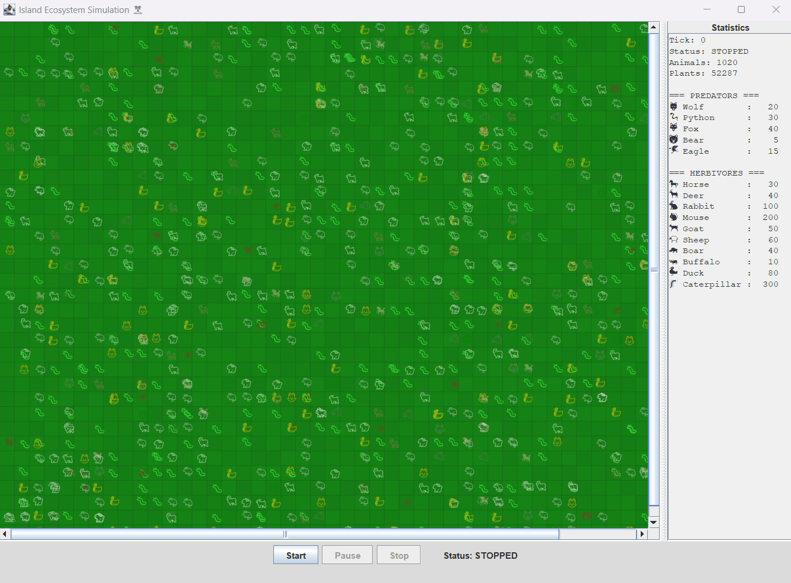

# 🏝️ Island Ecosystem Simulation


<div align="center">



**Моделирование экосистемы острова с использованием ООП и многопоточности**
</div>

## 📋 Оглавление
- [🎯 Описание проекта](#-описание-проекта)
- [✨ Особенности](#-особенности)
- [🏗️ Архитектура](#️-архитектура)
- [🚀 Быстрый старт](#-быстрый-старт)
- [🧪 Тестирование](#-тестирование)
- [📊 Конфигурация](#-конфигурация)
- [📁 Структура проекта](#-структура-проекта)

## 🎯 Описание проекта

Имитационная модель экосистемы острова, где различные виды животных взаимодействуют друг с другом в соответствии с природными законами. Проект реализован с использованием объектно-ориентированного программирования (ООП) и многопоточности.

**Основные возможности:**
- 🐺 5 видов хищников и 10 видов травоядных
- 🌱 Динамический рост растений
- 🔄 Параллельная обработка тысяч существ
- 📊 Реальная статистика в режиме реального времени
- 🎨 Визуализация с использованием Unicode-символов

## ✨ Особенности

### 🎭 Моделирование поведения животных
- **Питание**: Вероятностное поедание
- **Движение**: Случайное перемещение с ограниченной скоростью
- **Размножение**: При наличии пары в клетке
- **Смерть**: От голода или будучи съеденным

### ⚡ Технологический стек
- **Java 11+** - основной язык программирования
- **Swing** - графический интерфейс
- **JUnit 5 + Mockito** - модульное тестирование
- **Maven** - управление зависимостями и сборка
- **Многопоточность** - ScheduledExecutorService для параллельной обработки

### 📈 Статистика
- Количество животных каждого вида
- Общее количество растений
- Уровень сытости животных
- Количество тактов симуляции

## 🏗️ Архитектура

### 🎪 Иерархия классов
```
Animal (abstract)
├── Predator (abstract)
│   ├── Wolf 🐺
│   ├── Python 🐍
│   ├── Fox 🦊
│   ├── Bear 🐻
│   └── Eagle 🦅
└── Herbivore (abstract)
    ├── Horse 🐎
    ├── Deer 🦌
    ├── Rabbit 🐇
    ├── Mouse 🐁
    ├── Goat 🐐
    ├── Sheep 🐑
    ├── Boar 🐗
    ├── Buffalo 🐃
    ├── Duck 🦆
    └── Caterpillar 🐛
```

### 🔧 Ключевые компоненты
1. **SimulationConfig** - централизованная конфигурация
2. **Island** - управление сеткой клеток
3. **Cell** - отдельная клетка с животными и растениями
4. **SimulationEngine** - движок симуляции с многопоточностью
5. **UI Components** - визуализация (Swing)

## 🚀 Быстрый старт

### Предварительные требования
- Java JDK 11 или выше
- Maven 3.6+
- IntelliJ IDEA (рекомендуется) или другая Java IDE

### Установка и запуск

#### Способ 1: Через Maven
```bash
# Клонирование репозитория
git clone https://github.com/ваш-username/island-simulation.git
cd island-simulation

# Сборка проекта
mvn clean compile

# Запуск приложения
mvn exec:java -Dexec.mainClass="Main"

# Или создание исполняемого JAR
mvn package
java -jar target/island-simulation-1.0-SNAPSHOT.jar
```

#### Способ 2: Через IntelliJ IDEA
1. Откройте проект в IntelliJ IDEA
2. Дождитесь индексации и загрузки зависимостей
3. Найдите класс `Main.java`
4. Нажмите ▶️ Run

#### Способ 3: Прямая компиляция
```bash
# Компиляция
javac -d out src/main/java/**/*.java src/main/java/Main.java

# Запуск
java -cp out Main
```

## 🧪 Тестирование

Проект включает комплексные тесты с покрытием ключевой функциональности:

### Запуск тестов
```bash
# Все тесты
mvn test

# Конкретный тестовый класс
mvn test -Dtest=AnimalTest

# Создание отчета о покрытии
mvn jacoco:report
```

### Структура тестов
```
src/test/java/
├── config/              # Тесты конфигурации
│   └── SimulationConfigTest.java
├── model/              # Тесты модели
│   ├── AnimalTest.java
│   ├── CellTest.java
│   ├── IslandTest.java
│   └── animals/        # Тесты конкретных животных
└── engine/             # Тесты движка
    └── SimulationEngineTest.java
```

### Примеры тестируемых сценариев
- ✅ Создание и инициализация объектов
- ✅ Правильность пищевых цепочек
- ✅ Ограничения на максимальное количество
- ✅ Вероятностные события (поедание, размножение)
- ✅ Многопоточная обработка

## 📊 Конфигурация

Все параметры симуляции настраиваются в одном файле:

### Основные параметры (`SimulationConfig.java`)
```java
// Размеры острова
public static final int ISLAND_WIDTH = 100;
public static final int ISLAND_HEIGHT = 20;

// Временные параметры
public static final int SIMULATION_TICK_MS = 500;

// Растения
public static final int MAX_PLANTS_PER_CELL = 200;
public static final double PLANT_GROWTH_PROBABILITY = 0.3;

// Животные (данные из таблиц Excel)
public static final Map<AnimalType, Double> ANIMAL_WEIGHTS = ...;
public static final Map<AnimalType, Integer> MAX_ANIMALS_PER_CELL = ...;
public static final Map<AnimalType, Integer> MOVEMENT_SPEED = ...;
```


## 📁 Структура проекта

```
island-simulation/
├── src/main/java/
│   ├── config/              # Конфигурация и перечисления
│   │   ├── AnimalType.java
│   │   └── SimulationConfig.java
│   ├── model/              # Доменная модель
│   │   ├── animals/        # Конкретные классы животных
│   │   ├── Animal.java     # Абстрактный класс животного
│   │   ├── Predator.java   # Абстрактный класс хищника
│   │   ├── Herbivore.java  # Абстрактный класс травоядного
│   │   ├── Plant.java      # Класс растения
│   │   ├── Location.java   # Координаты
│   │   ├── Cell.java       # Клетка острова
│   │   └── Island.java     # Остров (сетка клеток)
│   ├── engine/             # Логика симуляции
│   │   └── SimulationEngine.java
│   ├── ui/                 # Пользовательский интерфейс
│   │   ├── IslandSimulation.java
│   │   ├── IslandPanel.java
│   │   ├── StatsPanel.java
│   │   └── ControlPanel.java
│   └── Main.java           # Точка входа
├── src/test/java/          # Тесты
├── src/main/resources/     # Ресурсы
├── pom.xml                 # Конфигурация Maven
└── README.md               # Эта документация
```
---

<div align="center">

**Наслаждайтесь моделированием экосистемы!** 🎮

⭐ Если вам понравился проект, поставьте звезду на GitHub!

</div>